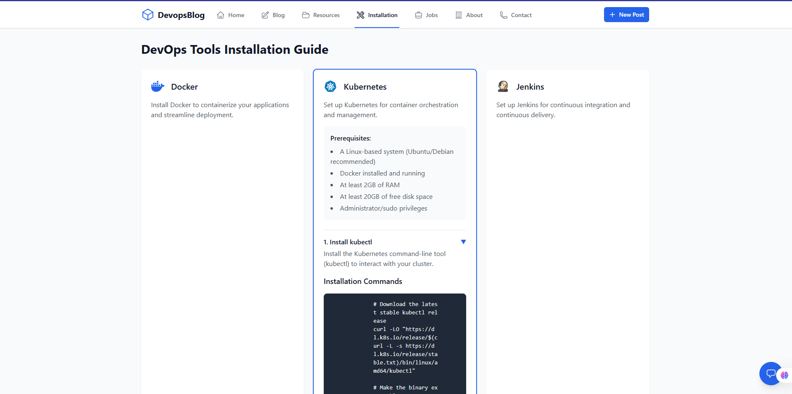

# DevOps Blog Project

A modern React-based blog website demonstrating end-to-end DevOps practices, including CI/CD pipeline implementation, containerization, and Kubernetes deployment. Built with React, Vite, and Tailwind CSS.

## 🚀 Project Overview

This project showcases a complete DevOps workflow, from development to deployment, including:
- Modern web application development with React
- Continuous Integration using GitHub Actions
- Containerization with Docker
- Continuous Deployment using k0s (lightweight Kubernetes)


## 🛠️ Technology Stack

- **Frontend**: React, Vite, Tailwind CSS
- **Containerization**: Docker
- **CI/CD**: GitHub Actions
- **Container Registry**: Docker Hub
- **Orchestration**: k0s (Lightweight Kubernetes)
- **Web Server**: Nginx

## 📋 Prerequisites

Before you begin, ensure you have the following installed on your system:

1. **Node.js and npm**
   - Download and install from [Node.js official website](https://nodejs.org/)
   - Verify installation:
     ```bash
     node --version  # Should be v18 or later
     npm --version   # Should be v8 or later
     ```

2. **Docker**
   - Download and install from [Docker official website](https://www.docker.com/products/docker-desktop)
   - Verify installation:
     ```bash
     docker --version
     docker-compose --version
     ```

3. **k0s (for Kubernetes deployment)**
   - Install k0s following the [official documentation](https://docs.k0sproject.io/stable/install/)
   - Verify installation:
     ```bash
     k0s version
     ```

4. **Git**
   - Download and install from [Git official website](https://git-scm.com/downloads)
   - Verify installation:
     ```bash
     git --version
     ```

5. **Required Accounts**
   - [GitHub Account](https://github.com/signup)
   - [Docker Hub Account](https://hub.docker.com/signup)

## 🚀 Getting Started

Follow these steps to set up the project on your local system:

### 1. Clone the Repository
```bash
git clone https://github.com/RAIYANBHUIYAN/DevOps_Blog.git
cd DevOps_Blog
```

### 2. Local Development Setup

#### Option A: Run Locally (Development Mode)
```bash
# Install dependencies
npm install

# Start development server
npm run dev

# Access the application at http://localhost:3000
```

#### Option B: Run with Docker
```bash
# Pull the pre-built image
docker pull raiyan77/devopsblog

# Run the container
docker run -p 80:80 raiyan77/devopsblog

# Access the application at http://localhost
```

#### Option C: Build and Run Docker Image Locally
```bash
# Build the Docker image
docker build -t devops-blog .

# Run the container
docker run -p 80:80 devops-blog

# Access the application at http://localhost
```

### 3. Kubernetes Deployment (k0s)

1. **Start k0s**
   ```bash
   # Start k0s as a service
   k0s start
   
   # Get kubeconfig
   k0s kubeconfig > kubeconfig
   
   # Set KUBECONFIG environment variable
   export KUBECONFIG=kubeconfig
   ```

2. **Deploy the Application**
   ```bash
   # Apply Kubernetes configurations
   kubectl apply -f deployment.yaml
   kubectl apply -f service.yaml
   
   # Verify deployment
   kubectl get pods
   kubectl get services
   ```

3. **Access the Application**
   - Get the service URL:
     ```bash
     kubectl get service devops-blog-service
     ```
   - Access the application using the provided URL or IP address

### 4. Verify the Setup

1. **Check Application Status**
   - Open your web browser and navigate to:
     - Local development: http://localhost:3000
     - Docker: http://localhost
     - Kubernetes: Use the service URL from `kubectl get service`

2. **Verify Components**
   ```bash
   # Check Docker container
   docker ps
   
   # Check Kubernetes pods
   kubectl get pods
   
   # Check Kubernetes services
   kubectl get services
   ```

### 5. Troubleshooting

If you encounter any issues:

1. **Docker Issues**
   ```bash
   # Check Docker logs
   docker logs <container-id>
   
   # Check Docker container status
   docker ps -a
   ```

2. **Kubernetes Issues**
   ```bash
   # Check pod status
   kubectl describe pod <pod-name>
   
   # Check pod logs
   kubectl logs <pod-name>
   
   # Check service status
   kubectl describe service devops-blog-service
   ```

3. **Application Issues**
   - Check browser console for frontend errors
   - Verify all environment variables are set correctly
   - Ensure all required ports are available and not in use

## 🔄 CI/CD Pipeline

### Continuous Integration (CI)

The CI pipeline is implemented using GitHub Actions, which:
1. Builds the application
2. Runs tests
3. Creates a Docker image
4. Pushes the image to Docker Hub


### Docker Containerization

The application is containerized using Docker for consistent deployment across environments. The Docker image is available on Docker Hub and can be pulled using:

```bash
docker pull raiyan77/devopsblog
```


### Continuous Deployment (CD)

The CD pipeline deploys the application to a k0s cluster:
1. Pulls the latest Docker image
2. Deploys to Kubernetes using deployment and service configurations
3. Ensures high availability and scalability


## 🚀 Deployment Process

1. **Local Development**
   ```bash
   git clone <repository-url>
   cd devops-blog
   npm install
   npm run dev
   ```

2. **Docker Build and Run**
   ```bash
   docker build -t devops-blog .
   docker run -p 80:80 devops-blog
   ```

3. **Kubernetes Deployment**
   ```bash
   kubectl apply -f deployment.yaml
   kubectl apply -f service.yaml
   ```

## 📸 Application Screenshots

### Home Page


### Blog Posts


### Individual Post


### About Page


## 📁 Project Structure

```
devops-blog/
├── src/                    # Source code
│   ├── components/        # Reusable components
│   ├── pages/            # Page components
│   ├── App.jsx           # Main application component
│   └── main.jsx          # Application entry point
├── .github/              # GitHub Actions workflows
│   └── workflows/        # CI/CD pipeline configurations
├── screen_shots/         # Documentation screenshots
├── public/               # Static assets
├── Dockerfile            # Docker configuration
├── nginx.conf            # Nginx configuration
├── deployment.yaml       # Kubernetes deployment config
├── service.yaml          # Kubernetes service config
└── package.json          # Project dependencies and scripts
```

## 🔍 Monitoring and Logs

The application's deployment status and logs can be monitored through:
- GitHub Actions dashboard
- Docker Hub repository
- k0s cluster dashboard
- Kubernetes logs

## 🤝 Contributing

1. Fork the repository
2. Create your feature branch (`git checkout -b feature/amazing-feature`)
3. Commit your changes (`git commit -m 'Add some amazing feature'`)
4. Push to the branch (`git push origin feature/amazing-feature`)
5. Open a Pull Request

## 📄 License

This project is licensed under the MIT License - see the LICENSE file for details.

## 👥 Author

- Raiyan Bhuiyan
- GitHub: [@RAIYANBHUIYAN](https://github.com/RAIYANBHUIYAN) 